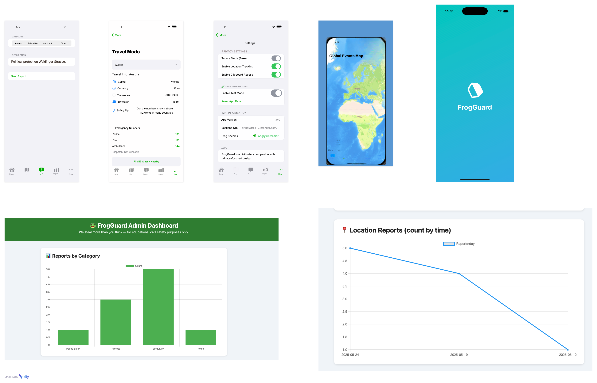

## 🎨 FrogGuard Design Overview

### 🧭 Structure Overview:

**1. Home**

* “FrogGuard Safety Dashboard” headline
* Buttons: “Rescan Area” & “Simulate Privacy Leak”
* Simulated access data: battery, clipboard, device, OS version

**2. Settings**

* Toggles: Secure Mode, Location Tracking, Clipboard Access
* Developer tools: Test Mode, Reset App Data
* App info: Version, Frog Species, Backend URL

**3. Report**

* Categories: Protest, Police Blockade, Medical Accident, Other
* Description input
* Submission with confirmation

**4. Map View**

* Apple Maps displaying global geography
* Future plan: marker pins per report type

**5. Insights**

* Log of recent reports
* Simulated data interactions (device + timestamp)

**6. Travel Mode**

* Dropdown: country selector
* Info: Capital, Currency, Timezone, Driving Side, Safety Tips
* Emergency numbers: Police, Fire, Ambulance
* “Find Embassy Nearby” button

---

### 🖌 Visual Design

* **Color Scheme:**

  * Primary green: `#00C853`
  * White backgrounds, light grey dividers
  * Orange for risk simulation
* **Fonts:**

  * SF Pro (default iOS), monospaced for debug sections
* **Icons:**

  * Apple SF Symbols (map, report, shield, exclamation)

---

### ✨ Future Ideas

* Real event pins on map
* Live API integration for country data
* Offline emergency database
* Custom frog personas per user
